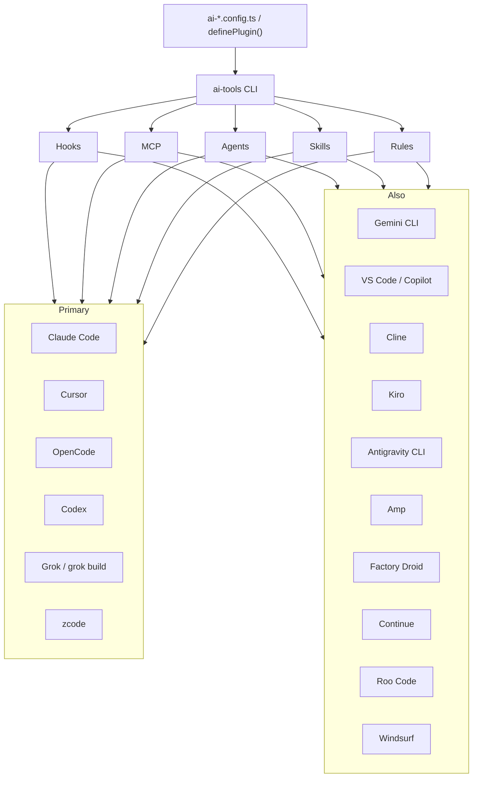

# ai-tools

[](https://github.com/itz4blitz/ai-tools/actions/workflows/pipeline.yml)
[](https://www.npmjs.com/package/@itz4blitz/ai-tools)


**Write your AI-tool config once. `ai-tools` emits the native files each host actually reads.**

Hooks, MCP servers, skills, agents, and rules all have a different shape in Claude Code, Cursor, OpenCode, and Codex. This CLI is the translator — plus a plugin bundle layer so you can ship one capability pack onto the hosts installed on the machine.

```bash
npx @itz4blitz/ai-tools@latest detect
```

## Hosts

Primary fleet is Claude Code, Cursor, OpenCode, Codex, plus Grok and zcode next. The other adapters still ship.

| Host | Hooks | MCP | Agents | Skills | Rules |
|------|:-----:|:---:|:------:|:------:|:-----:|
| [Claude Code](https://docs.anthropic.com/en/docs/claude-code) | ✓ | ✓ | ✓ | ✓ | ✓ |
| [Cursor](https://cursor.com) | ✓ | ✓ | ✓ | ✓ | ✓ |
| [OpenCode](https://opencode.ai) | ✓ | ✓ | ✓ | ✓ | ✓ |
| [Codex](https://openai.com/codex/) | ✓ | ✓ | ✓ | ✓ | ✓ |
| Grok / grok build | ✓ | ✓ | ✓ | ✓ | ✓ |
| zcode | ✓ | ✓ | ✓ | ✓ | ✓ |
| [Gemini CLI](https://github.com/google-gemini/gemini-cli) | ✓ | ✓ | ✓ | ✓ | ✓ |
| [Antigravity CLI](https://www.antigravity.google/product/antigravity-cli) | | | ✓ | ✓ | ✓ |
| [Kiro](https://kiro.dev) | ✓ | ✓ | ✓ | ✓ | ✓ |
| [Cline](https://cline.bot) | ✓ | ✓ | ✓ | ✓ | ✓ |
| [Amp](https://ampcode.com) | | ✓ | | ✓ | ✓ |
| [Factory Droid](https://factory.ai) | ✓ | ✓ | ✓ | ✓ | ✓ |
| [VS Code / Copilot](https://code.visualstudio.com) | ✱ | ✓ | ✓ | ✓ | ✓ |
| [Continue](https://continue.dev) | | | | ✓ | ✓ |
| [Roo Code](https://roocode.com) | | ✓ | ✓ | ✓ | ✓ |
| [Windsurf](https://windsurf.com) | | ✓ | | ✓ | ✓ |

<sub>✱ VS Code 1.109+ agent hooks use the Claude Code format. Grok and ZCode adapters cover hooks/MCP/agents/skills/rules.</sub>

## 60-second path

```bash
npm i -D @itz4blitz/ai-tools

# What is installed on this machine?
npx ai-tools detect

# One capability bundle → plan → native files
npx ai-tools plugins init
npx ai-tools plugins plan --tools=claude-code,cursor,opencode,codex
npx ai-tools plugins install --tools=claude-code,cursor,opencode,codex
```

Per-engine flow is the same everywhere: `init` → `detect` → `generate` → `install`.

```bash
npx ai-tools hooks generate && npx ai-tools hooks install
npx ai-tools mcp generate && npx ai-tools mcp install
npx ai-tools skills generate && npx ai-tools skills install
npx ai-tools agents generate && npx ai-tools agents install
npx ai-tools rules generate && npx ai-tools rules install
```

Canonical mode keeps a single store under `.ai-tools/` and installs out from there:

```bash
npx ai-tools init
npx ai-tools generate
npx ai-tools install
npx ai-tools status
```



## Plugin bundle

`definePlugin()` is the portable authoring surface. `plugins plan` tells you what each host can actually consume; `plugins install` writes only the supported pieces.

```ts
// ai-plugin.config.ts
import { definePlugin } from "@itz4blitz/ai-tools";

export default definePlugin({
  id: "release-confidence",
  name: "Release Confidence",
  version: "0.1.0",
  targets: {
    include: ["claude-code", "cursor", "opencode", "codex"],
  },
  mcpServers: [
    {
      id: "example-mcp",
      name: "Example MCP",
      transport: { type: "stdio", command: "npx", args: ["-y", "example-mcp"] },
    },
  ],
  skills: [
    {
      id: "ship-check",
      name: "Ship Check",
      content: "Run the failing test first, then the smallest fix that makes it pass.",
    },
  ],
});
```

Hosts are not identical. Cursor and Codex can take a broad bundle. OpenCode has MCP plus a native plugin system. Claude Code is project-level hooks, agents, commands, and MCP.

## Config examples

### Hooks

```ts
// ai-hooks.config.ts
import { defineConfig, hook, builtinHooks } from "@itz4blitz/ai-tools/hooks";

export default defineConfig({
  extends: [{ hooks: builtinHooks }],
  hooks: [
    hook("before", ["shell:before"], async (ctx, next) => {
      if (ctx.event.command.includes("npm publish")) {
        ctx.results.push({ blocked: true, reason: "Publishing is restricted" });
        return;
      }
      await next();
    })
      .id("org:block-publish")
      .name("Block npm publish")
      .priority(10)
      .build(),
  ],
  settings: { hookTimeout: 5000, failMode: "open", logLevel: "warn" },
});
```

### MCP

```ts
// mcp.config.ts
import { defineConfig } from "@itz4blitz/ai-tools/mcp";

export default defineConfig({
  servers: [
    {
      id: "filesystem",
      name: "filesystem",
      transport: {
        type: "stdio",
        command: "npx",
        args: ["-y", "@modelcontextprotocol/server-filesystem", "./src"],
      },
      layer: "project",
    },
    {
      id: "palamhealth",
      name: "PalamHealth",
      transport: { type: "stdio", command: "palamhealth-mcp" },
      layer: "project",
      whenPathContains: ["PalamHealth"],
    },
  ],
});
```

`ai-tools mcp install --layer=project` writes only matching servers. `ai-tools mcp sync` never copies imported servers between tools. `ai-tools mcp audit` reports PalamHealth leaks in user-global configs.

### Rules

```ts
// ai-rules.config.ts
import { defineRulesConfig } from "@itz4blitz/ai-tools/rules";

export default defineRulesConfig({
  rules: [
    {
      id: "typescript-strict",
      name: "typescript-strict",
      content: "Always use strict TypeScript. No `any` types.",
      scope: { type: "always" },
      priority: 1,
    },
  ],
});
```

## Hooks runtime

Express-style middleware over a 15-event model. Before-events can block; after-events are observe-only.

| Category | Before (blockable) | After |
|----------|--------------------|-------|
| Session | `session:start` | `session:end` |
| Prompt | `prompt:submit` | `prompt:response` |
| Tool | `tool:before` | `tool:after` |
| File | `file:read`, `file:write`, `file:edit`, `file:delete` | |
| Shell | `shell:before` | `shell:after` |
| MCP | `mcp:before` | `mcp:after` |
| System | | `notification` |

Built-in guardrails: `block-dangerous-commands`, `scan-secrets`, `protect-sensitive-files`, `audit-shell`.

```ts
import { HookEngine, builtinHooks } from "@itz4blitz/ai-tools/hooks";

const engine = new HookEngine({
  hooks: builtinHooks,
  settings: { failMode: "closed" },
});

const result = await engine.isBlocked(event, { name: "my-platform", version: "1.0" });
if (result.blocked) console.log(result.reason);
```

## CLI

```text
ai-tools <engine> <command>
ai-tools detect | sync | init | generate | install | status | clean
```

| Engine | Job |
|--------|-----|
| `hooks` | Lifecycle guardrails |
| `mcp` | MCP server config |
| `skills` | Skills / prompts |
| `agents` | Agent personas |
| `rules` | Project rules |
| `plugins` | Portable bundles |
| `sessions` | Cross-tool session read / handoff |

Public install is **one package**: [`@itz4blitz/ai-tools`](https://www.npmjs.com/package/@itz4blitz/ai-tools). The `packages/*` workspaces in this repo are how the engines are developed; they are not separately published.

## Develop

```bash
git clone https://github.com/itz4blitz/ai-tools.git
cd ai-tools
npm install
npm run check
```

| Command | What it does |
|---------|--------------|
| `npm run check` | lint + format + typecheck + coverage-gated tests + smoke |
| `npm run build` | Turborepo build |
| `npm test` | vitest |
| `npx vitest run packages/hooks` | one package |

See [CONTRIBUTING.md](CONTRIBUTING.md).

## License

MIT
