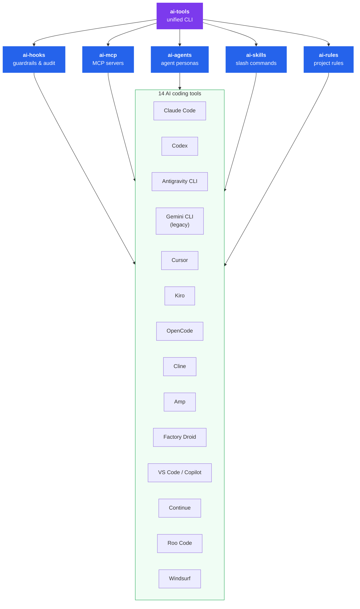

# ai-tools


**Universal configuration and runtime engine for AI coding tools. Install one package, target many tools.**

`@premierstudio/ai-tools` is the single public package for this project.

This repository still uses multiple internal workspaces so hooks, MCP, agents, skills, rules, sessions, and UI can be developed and tested cleanly. But those workspaces are implementation details. Consumers should install one package and let it orchestrate the rest.

## Why

Every AI coding tool has its own format for hooks, MCP servers, agents, skills, and rules. If you use more than one tool — or your team does — you're maintaining the same configuration in multiple places.

ai-tools lets you define each configuration surface once. Adapters translate it into the native format for every tool you use: Claude Code, Codex, OpenCode, VS Code / Copilot, Antigravity CLI, legacy Gemini CLI, and others.

Five engines — one for each configuration surface — plus a unified CLI that orchestrates them all.

On top of those engines, `ai-tools` can now act as a portable plugin authoring layer. Instead of hand-authoring separate Cursor plugins, Codex plugins, OpenCode prompts, and Claude-specific MCP config, you can define one capability bundle and let `ai-tools` map it onto the hosts you actually have installed.



## Packages

| Package | CLI | Description |
|---------|-----|-------------|
| [`@premierstudio/ai-tools`](packages/cli) | `ai-tools` | Public package: unified CLI and runtime for all engines |
| [`packages/hooks`](packages/hooks) | internal | Internal hooks engine implementation (`@premierstudio/ai-tools/hooks`) |
| [`packages/mcp`](packages/mcp) | internal | Internal MCP engine implementation (`@premierstudio/ai-tools/mcp`) |
| [`packages/agents`](packages/agents) | internal | Internal agents engine implementation (`@premierstudio/ai-tools/agents`) |
| [`packages/skills`](packages/skills) | internal | Internal skills engine implementation (`@premierstudio/ai-tools/skills`) |
| [`packages/rules`](packages/rules) | internal | Internal rules engine implementation (`@premierstudio/ai-tools/rules`) |

## Supported tools

| Tool | Hooks | MCP | Agents | Skills | Rules |
|------|:-----:|:---:|:------:|:------:|:-----:|
| [Claude Code](https://docs.anthropic.com/en/docs/claude-code) | &check; | &check; | &check; | &check; | &check; |
| [Codex](https://openai.com/codex/) | &check; | &check; | &check; | &check; | &check; |
| [Antigravity CLI](https://www.antigravity.google/product/antigravity-cli) | | | &check; | &check; | &check; |
| [Gemini CLI](https://github.com/google-gemini/gemini-cli) legacy | &check; | &check; | &check; | &check; | &check; |
| [Cursor](https://cursor.com) | &check; | &check; | &check; | &check; | &check; |
| [Kiro](https://kiro.dev) | &check; | &check; | &check; | &check; | &check; |
| [OpenCode](https://opencode.ai) | &check; | &check; | &check; | &check; | &check; |
| [Cline](https://cline.bot) | &check; | &check; | &check; | &check; | &check; |
| [Amp](https://ampcode.com) | | &check; | | &check; | &check; |
| [Factory Droid](https://factory.ai) | &check; | &check; | &check; | &check; | &check; |
| [VS Code / Copilot](https://code.visualstudio.com) | &ast; | &check; | &check; | &check; | &check; |
| [Continue](https://continue.dev) | | | | &check; | &check; |
| [Roo Code](https://roocode.com) | | &check; | &check; | &check; | &check; |
| [Windsurf](https://windsurf.com) | | &check; | | &check; | &check; |

<sub>&ast; VS Code 1.109+ agent hooks use the Claude Code format — the Claude Code adapter output works directly.</sub>

<sub>Antigravity CLI supports native plugins that can bundle MCP servers and hooks. ai-tools currently targets Antigravity workspace skills, rules, and agent templates directly; native Antigravity plugin installation is the next adapter layer.</sub>

## Quick start

### Unified CLI

```bash
# Run instantly (recommended)
npx @premierstudio/ai-tools@latest detect

# Install everything
npm i -D @premierstudio/ai-tools

# Detect installed tools, generate configs, install them
ai-tools detect
ai-tools hooks generate && ai-tools hooks install
ai-tools mcp generate && ai-tools mcp install
ai-tools skills generate && ai-tools skills install
ai-tools agents generate && ai-tools agents install
ai-tools rules generate && ai-tools rules install

# Portable plugin bundles
ai-tools plugins init
ai-tools plugins detect
ai-tools plugins plan --tools=cursor,codex,opencode,claude-code,antigravity-cli
ai-tools plugins install --tools=cursor,codex,opencode,claude-code
```

### Portable plugin bundles

`ai-tools` now supports a plugin-style authoring model for cross-tool distribution.

Use `definePlugin()` from `@premierstudio/ai-tools` to describe a capability bundle once:

- MCP servers
- skills
- agents
- hooks

Then use `ai-tools plugins plan` to see what each target host can actually consume, and `ai-tools plugins install` to deploy supported surfaces into the detected tools on the current machine.

Example:

```ts
// ai-plugin.config.ts
import { definePlugin } from "@premierstudio/ai-tools";

export default definePlugin({
  id: "cert-coach",
  name: "Certification Coach",
  version: "0.1.0",
  targets: {
    include: ["cursor", "codex", "opencode", "claude-code", "antigravity-cli"],
  },
  mcpServers: [
    {
      id: "cert-coach",
      name: "Certification Coach",
      transport: {
        type: "stdio",
        command: "npx",
        args: ["cert-coach-mcp"],
      },
    },
  ],
  skills: [
    {
      id: "study-start",
      name: "Study Start",
      description: "Kick off a study session using the certification coach MCP.",
      content: "Start or resume a study session before answering study requests.",
    },
  ],
});
```

This is intentionally capability-aware rather than pretending every host has the same extension surface.

- Cursor can consume a broad plugin bundle and supports interactive MCP Apps.
- Codex can bundle skills, MCP, hooks, custom agents, and app integrations.
- OpenCode supports MCP plus a native plugin system across terminal, desktop, and IDE surfaces.
- Antigravity CLI supports `.agents` workspace customizations now; native Antigravity plugin staging is planned for MCP and hooks.
- Claude Desktop is currently MCP-first in `ai-tools`; rich interactive experiences there come through desktop extensions and remote interactive connectors rather than rules or skills.

### Internal engine development

```bash
# This repo still contains separate engine workspaces for development.
# They are internal implementation details rather than the public install surface.
```

Each engine follows the same CLI pattern: `init` → `detect` → `generate` → `install`. Use `import` or `sync` to pull existing tool-specific configs back into the universal format.

## Config examples

### Hooks

```ts
// ai-hooks.config.ts
import { defineConfig, hook, builtinHooks } from "@premierstudio/ai-tools/hooks";

export default defineConfig({
  extends: [{ hooks: builtinHooks }],
  hooks: [
    hook("before", ["shell:before"], async (ctx, next) => {
      if (ctx.event.command.includes("npm publish")) {
        ctx.results.push({ blocked: true, reason: "Publishing is restricted" });
        return;
      }
      await next();
    })
      .id("org:block-publish")
      .name("Block npm publish")
      .priority(10)
      .build(),
  ],
  settings: {
    hookTimeout: 5000,
    failMode: "open",
    logLevel: "warn",
  },
});
```

### MCP servers

```ts
// ai-mcp.config.ts
import { defineConfig } from "@premierstudio/ai-tools/mcp";

export default defineConfig({
  servers: [
    {
      name: "filesystem",
      command: "npx",
      args: ["-y", "@modelcontextprotocol/server-filesystem", "./src"],
      transport: "stdio",
    },
  ],
});
```

### Rules

```ts
// ai-rules.config.ts
import { defineRulesConfig } from "@premierstudio/ai-tools/rules";

export default defineRulesConfig({
  rules: [
    {
      name: "typescript-strict",
      content: "Always use strict TypeScript. No `any` types.",
      scope: "always",
      priority: 1,
    },
    {
      name: "test-conventions",
      content: "Co-locate tests as *.test.ts next to source files.",
      scope: "glob",
      globs: ["**/*.test.ts"],
    },
  ],
});
```

## Hooks engine

The hooks engine is the most powerful package — an Express.js-style middleware chain for AI tool actions.

### Universal event model

15 event types across the full AI tool lifecycle:

| Category | Before (blockable) | After (observe-only) |
|----------|-------------------|---------------------|
| Session | `session:start` | `session:end` |
| Prompt | `prompt:submit` | `prompt:response` |
| Tool | `tool:before` | `tool:after` |
| File | `file:read`, `file:write`, `file:edit`, `file:delete` | |
| Shell | `shell:before` | `shell:after` |
| MCP | `mcp:before` | `mcp:after` |
| System | | `notification` |

### Built-in safety hooks

| Hook | Phase | What it does |
|------|-------|-------------|
| `block-dangerous-commands` | before | Blocks `rm -rf /`, `DROP DATABASE`, fork bombs |
| `scan-secrets` | before | Detects API keys, tokens, private keys in file writes |
| `protect-sensitive-files` | before | Prevents writes to `.env`, `credentials.json`, SSH keys |
| `audit-shell` | after | Records command, exit code, duration, tool name |

### Using as a library

Import the engine directly for building platforms that orchestrate AI agents:

```ts
import { HookEngine, builtinHooks } from "@premierstudio/ai-tools/hooks";

const engine = new HookEngine({
  hooks: builtinHooks,
  settings: { failMode: "closed" },
});

const result = await engine.isBlocked(event, { name: "my-platform", version: "1.0" });
if (result.blocked) {
  console.log(`Blocked: ${result.reason}`);
}
```

## Development

```bash
git clone https://github.com/PremierStudio/ai-tools.git
cd ai-tools
npm install
npm run check   # lint + format + typecheck + coverage-gated tests
```

| Command | What it does |
|---------|-------------|
| `npm run check` | Full verification: lint + format + typecheck + coverage-gated tests |
| `npm run build` | Build all packages via Turborepo |
| `npm test` | Run all tests (vitest) |
| `npm run test:coverage` | Run Vitest with the repository coverage gate |
| `npx vitest run packages/hooks` | Test a single package |
| `npm run lint` | oxlint |
| `npm run fmt` | oxfmt (auto-format) |
| `npm run typecheck` | tsc across all packages |

See [CONTRIBUTING.md](CONTRIBUTING.md) for adding adapters and submitting PRs.

## License

MIT
