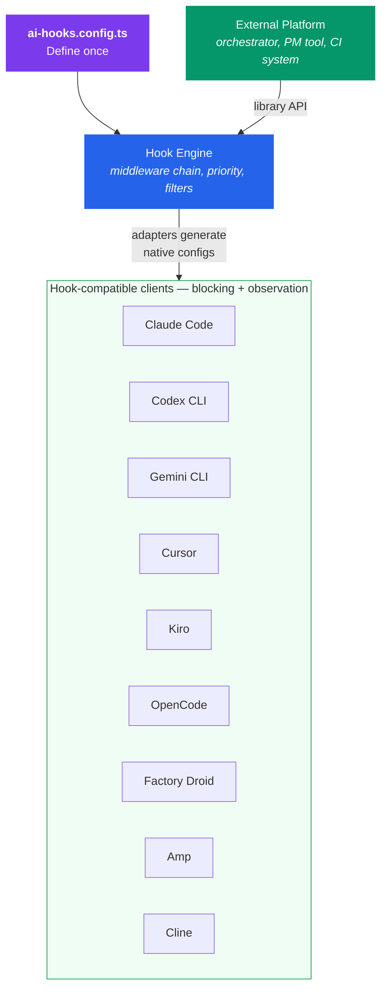

# ai-hooks


**Universal hook engine for AI coding tools. Write policy once — enforce it everywhere, or let external systems drive it.**

`ai-hooks` is an open-source framework for portable guardrails, audit trails, and runtime control across AI coding tools. Define hooks in one config and they work everywhere — Claude Code, Codex, Gemini CLI, Cursor, Kiro, Cline, and more. Or use it as a library to let external platforms programmatically steer the AI client a developer is using.

## The problem

AI coding tools are proliferating, and every team hits the same wall:

- **No unified policy layer.** Each tool has its own hook format, so guardrails get duplicated, drift, and break silently.
- **No external control plane.** If you need to programmatically steer the client a developer is using — set boundaries, collect signals, enforce workflow rules — there's no standard way to do it. You're locked into one vendor's API.
- **Fragmented audit trails.** Shell commands, file writes, and tool calls are logged in different formats per tool, making compliance and debugging painful.
- **Inconsistent enforcement.** Some tools can block dangerous actions before they happen; others can only observe after the fact. You need a framework that normalizes this.

## How ai-hooks solves it

ai-hooks gives you a single policy engine that can steer any AI coding client with native hook support. Write rules once, and adapters translate them into the exact config format each tool understands. Block, observe, or redirect actions across every tool from one place.



**Two ways to use it:**

1. **Config-driven** — Write an `ai-hooks.config.ts`, run `ai-hooks generate`, and adapters produce native hook configs for every detected tool. When the agent tries to run a shell command, write a file, or call a tool, your hooks fire natively inside the client — blocking dangerous actions, scanning for secrets, and logging everything before it happens.

2. **Library / control plane** — Import the engine into your platform. Programmatically steer the AI client a developer is using — set boundaries, collect signals, and enforce workflow rules — all through a standard API that works regardless of which tool they're running.

## Supported tools

| Tool                                                          | Blocking | Observation | Events |
| ------------------------------------------------------------- | -------- | ----------- | ------ |
| [Claude Code](https://docs.anthropic.com/en/docs/claude-code) | Yes      | Yes         | 13     |
| [Codex CLI](https://github.com/openai/codex)                  | Yes      | Yes         | 13     |
| [Gemini CLI](https://github.com/google-gemini/gemini-cli)     | Yes      | Yes         | 13     |
| [Cursor](https://cursor.com)                                  | Yes      | Yes         | 9      |
| [Kiro](https://kiro.dev)                                      | Yes      | Yes         | 14     |
| [OpenCode](https://opencode.ai)                               | Yes      | Yes         | 13     |
| [Factory Droid](https://factory.ai)                           | Yes      | Yes         | 9      |
| [Amp](https://ampcode.com)                                    | Yes      | Yes         | 2      |
| [Cline](https://cline.bot)                                    | Yes      | Yes         | 7      |

### Compatible tools (no separate adapter needed)

| Tool                                               | Notes                                                                                                                                                                          |
| -------------------------------------------------- | ------------------------------------------------------------------------------------------------------------------------------------------------------------------------------ |
| [VS Code / Copilot](https://code.visualstudio.com) | VS Code 1.109+ agent hooks use the same format as Claude Code. The Claude Code adapter output works directly in VS Code via `.claude/settings.json` or `.github/hooks/*.json`. |

## Quick start

```bash
# Install
npm i -D @premierstudio/ai-hooks

# Initialize config
npx ai-hooks init

# Detect installed tools and generate hooks
npx ai-hooks detect --verbose
npx ai-hooks generate
npx ai-hooks install
```

## Config example

```ts
// ai-hooks.config.ts
import { defineConfig, hook, builtinHooks } from "@premierstudio/ai-hooks";

export default defineConfig({
  extends: [{ hooks: builtinHooks }],
  hooks: [
    hook("before", ["shell:before"], async (ctx, next) => {
      if (ctx.event.command.includes("npm publish")) {
        ctx.results.push({ blocked: true, reason: "Publishing is restricted" });
        return;
      }
      await next();
    })
      .id("org:block-publish")
      .name("Block npm publish")
      .priority(10)
      .build(),
  ],
  settings: {
    hookTimeout: 5000,
    failMode: "open",
    logLevel: "warn",
  },
});
```

## Built-in safety hooks

ai-hooks ships with 4 hooks you can use immediately:

| Hook                       | Phase  | What it does                                            |
| -------------------------- | ------ | ------------------------------------------------------- |
| `block-dangerous-commands` | before | Blocks `rm -rf /`, `DROP DATABASE`, fork bombs          |
| `scan-secrets`             | before | Detects API keys, tokens, private keys in file writes   |
| `protect-sensitive-files`  | before | Prevents writes to `.env`, `credentials.json`, SSH keys |
| `audit-shell`              | after  | Records command, exit code, duration, tool name         |

## Universal event model

15 event types across the full AI tool lifecycle:

| Category | Before (blockable)                       | After (observe-only) |
| -------- | ---------------------------------------- | -------------------- |
| Session  | `session:start`                          | `session:end`        |
| Prompt   | `prompt:submit`                          | `prompt:response`    |
| Tool     | `tool:before`                            | `tool:after`         |
| File     | `file:write`, `file:edit`, `file:delete` | `file:read`          |
| Shell    | `shell:before`                           | `shell:after`        |
| MCP      | `mcp:before`                             | `mcp:after`          |
| System   | —                                        | `notification`       |

## Using as a library

If you're building a platform that orchestrates AI agents — a PM tool, CI system, or custom control plane — import the engine directly:

```ts
import { HookEngine, builtinHooks } from "@premierstudio/ai-hooks";

const engine = new HookEngine({
  hooks: builtinHooks,
  settings: { failMode: "closed" },
});

// Check if an action should be blocked
const result = await engine.isBlocked(event, { name: "my-platform", version: "1.0" });
if (result.blocked) {
  console.log(`Blocked: ${result.reason}`);
}
```

This gives your platform a standard interface for controlling what AI agents can do, regardless of which tool (Claude Code, Codex, Cursor, etc.) the developer is running.

## Packages

| Package                    | Description                                                               |
| -------------------------- | ------------------------------------------------------------------------- |
| `@premierstudio/ai-hooks`  | Core engine, 9 built-in adapters, CLI, types, config loader               |
| `@premierstudio/plannable` | CLI + preset for connecting AI tools to [Plannable](https://plannable.ai) |

## Development

```bash
git clone https://github.com/PremierStudio/ai-hooks.git
cd ai-hooks
npm install
npm run check   # lint + format + typecheck + test
```

See [CONTRIBUTING.md](CONTRIBUTING.md) for adding adapters and submitting PRs.

## License

MIT
